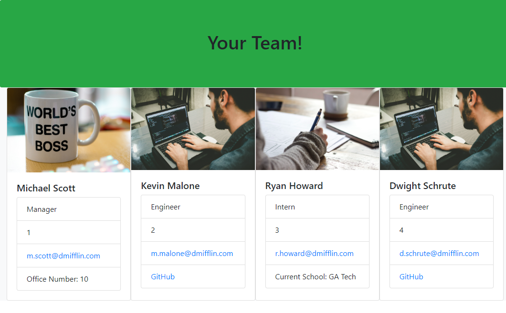

# Work Team Generator

## Table of Contents

- [Description](#description)
- [Installation](#installation)
- [Usage](#usage)
- [Video](#video)
- [License](#license)
- [Contribution](#contribution)
- [Contact](#contact)

## Description

This program was designed with with managers in mind who want to be able to quickly create a webpage with basic information for all of their employees. When users run this program, they are presented with a series of questions concerning the employees on a given team. Once all of the questions have been answered, it generates an HTML file that can be viewed to see an organized list of all team members.

## Installation

This program requires Node.js and NPM. Once these are installed, please run:
```
npm i
```
## Usage

For usage instructions, please do the following:

Enter node index.js into your terminal. You will then be prompted with a series of questions, concerning the members of your team. There are three types of employees that can be added in: Manager, Engineer, and Intern. Once you answer each question for one team member, it will ask you if you would like to add another user. If you select yes, it will go through the previous steps again. If you select no, it will generate a file titled team.html, that can be viewed to see the list of teammates. Each type of employee has its own picture in the card to make differentiating them easy.

A sample file of how this looks can be found in the Assets folder

Generated HTML page


## Video

[Link to instructional video](https://huntersteffner.github.io/Work-Team-Generator/)

## Card Image Credits
Boss image https://unsplash.com/photos/hEw2qUhk-fw

Engineer image  https://unsplash.com/photos/FCHlYvR5gJI

College Image https://unsplash.com/photos/s9CC2SKySJM


## Test

For testing purposes, please do the following:
```
npm run test
```
## Contribution

You may contact me directly, and then fork the project. Anyone can contribute, but please provide credit to the original work.

## Questions

Feel free to reach out to me directly if you have any questions or concerns. You can reach me via email, or check out my github profile below.

Email: huntersteffner@gmail.com

GitHub: [huntersteffner](https://github.com/huntersteffner/)

## Future developments

Add validation functionality to ensure that input is in the expected format.
